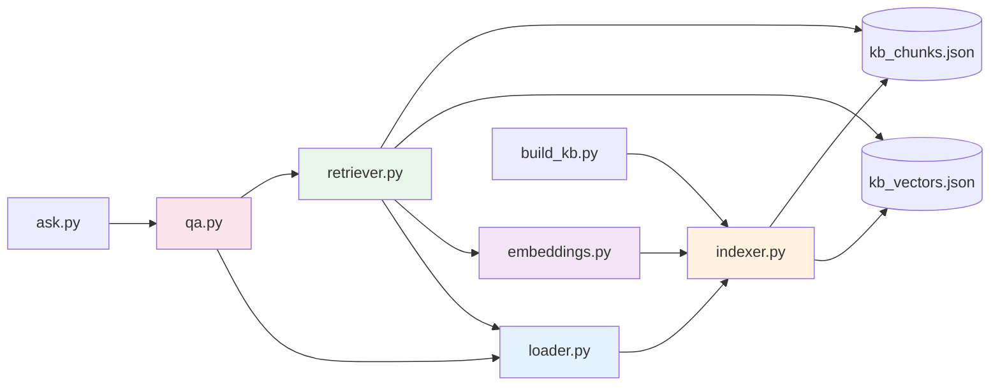
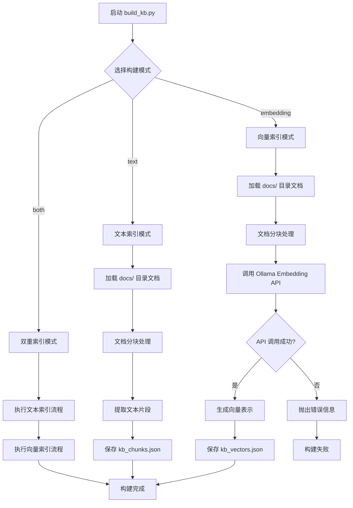
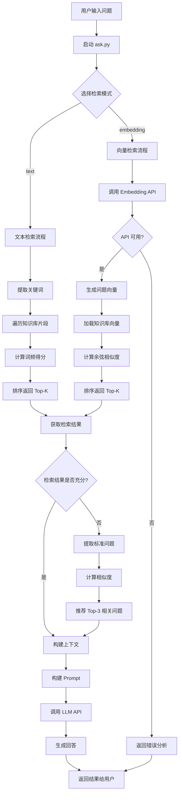
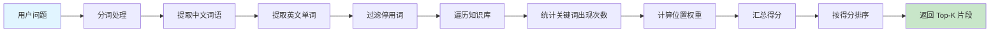
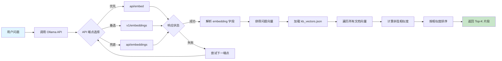
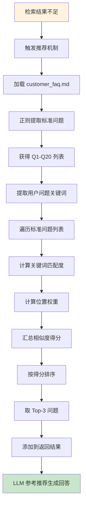
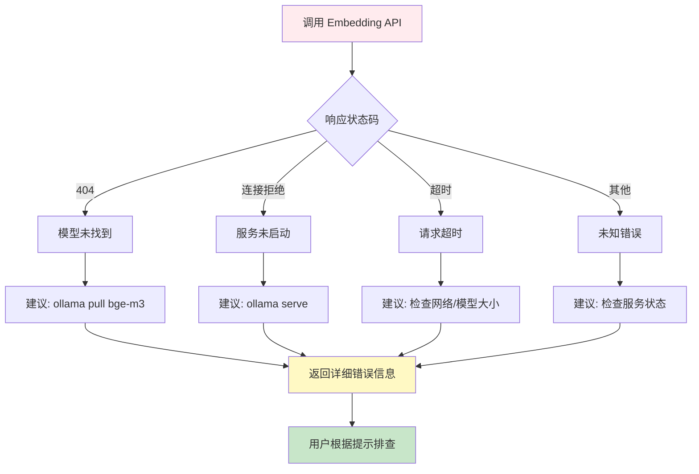
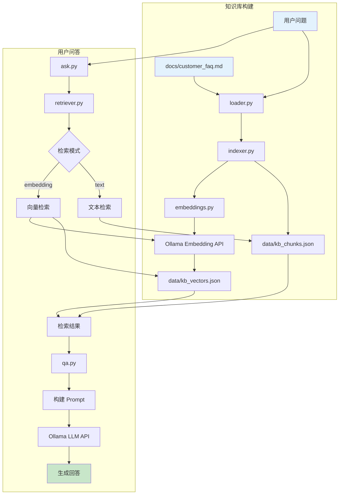

# 游戏客服机器人 Demo 项目总结

---

## 📋 项目概述

本项目是一个基于 RAG（Retrieval-Augmented Generation）技术的游戏客服机器人 Demo，实现了文本检索和向量检索两种检索方式，能够根据用户提问智能匹配知识库中的标准问答。

---

## 🏗️ 项目架构

```
├── scripts/              # 运行脚本
│   ├── ask.py            # 单问题测试
│   ├── build_kb.py       # 构建知识库
│   ├── compare_retrievals.py  # 检索对比
│   └── check_embedding_api.py # API 检查
├── src/
│   └── rag/
│       ├── __init__.py
│       ├── embeddings.py # 向量嵌入处理
│       ├── indexer.py    # 知识库索引
│       ├── loader.py     # 文档加载
│       ├── qa.py         # 问答逻辑
│       └── retriever.py  # 检索器（文本/向量）
├── docs/                 # 知识库文档
│   ├── customer_faq.md   # 客服 FAQ（20条标准问答）
│   └── game_product_doc.md # 产品文档
├── data/                 # 生成的索引数据
│   ├── kb_chunks.json    # 文本片段
│   └── kb_vectors.json   # 向量索引
├── .env                  # 环境配置
└── README.md
```

---

## 📦 模块详解

### 1. loader.py - 文档加载器

**核心职责：** 负责从文件系统加载 Markdown 文档并进行分块处理。

| 组件 | 类型 | 功能说明 |
|------|------|---------|
| `DocumentChunk` | 数据类 | 存储文档片段的元数据（chunk_id、content、source） |
| `_chunk_text()` | 函数 | 文本分块，支持重叠分块避免语义断裂 |
| `_load_markdown_file()` | 函数 | 读取 Markdown 文件内容（UTF-8 编码） |
| `load_chunks_from_docs()` | 函数 | 遍历 docs/ 目录，加载所有 .md 文件并分块 |
| `format_context()` | 函数 | 将检索结果格式化为 LLM 可理解的上下文字符串 |

**关键参数：**
- `CHUNK_SIZE`：分块大小（默认值在 config.py 中定义）
- `CHUNK_OVERLAP`：分块重叠大小，确保上下文连贯

**输入输出：**
```
输入: docs/*.md (Markdown 文件)
输出: List[DocumentChunk] (文档片段列表)
```

---

### 2. indexer.py - 知识库索引器

**核心职责：** 构建知识库的文本索引和向量索引，持久化存储到 data/ 目录。

| 组件 | 类型 | 功能说明 |
|------|------|---------|
| `KnowledgeIndexer` | 类 | 知识库索引管理器 |
| `rebuild()` | 方法 | 根据模式重建索引（text/embedding/both） |

**索引模式：**

| 模式 | 生成文件 | 说明 |
|------|---------|------|
| `text` | `kb_chunks.json` | 仅文本索引，包含 chunk_id、content、source |
| `embedding` | `kb_vectors.json` | 仅向量索引，额外包含 embedding 字段 |
| `both` | 两个文件都生成 | 完整索引，支持两种检索方式 |

**数据结构示例：**
```json
// kb_chunks.json
[
  {
    "chunk_id": "customer_faq-0",
    "content": "Q1：我忘记密码了怎么办？...",
    "source": "customer_faq.md"
  }
]

// kb_vectors.json
[
  {
    "chunk_id": "customer_faq-0",
    "content": "Q1：我忘记密码了怎么办？...",
    "source": "customer_faq.md",
    "embedding": [-0.0022844488, 0.024612414, ...]
  }
]
```

---

### 3. embeddings.py - 向量嵌入模块

**核心职责：** 将文本转换为高维向量表示，支持多种 Ollama API 端点。

| 组件 | 类型 | 功能说明 |
|------|------|---------|
| `_resolve_ollama()` | 函数 | 读取 Ollama 配置（base_url、model） |
| `embed_texts()` | 函数 | 批量将文本转换为向量 |

**API 端点优先级：**

| 优先级 | 端点 | 请求格式 | 响应字段 |
|--------|------|---------|---------|
| 1 | `/api/embed` | `{"model": "bge-m3", "input": "text"}` | `embedding` 或 `embeddings` |
| 2 | `/v1/embeddings` | `{"model": "bge-m3", "input": "text"}` | `data[0].embedding` |
| 3 | `/api/embeddings` | `{"model": "bge-m3", "prompt": "text"}` | `embedding` |

**关键特性：**
- 自动加载 `.env` 环境变量
- 支持多种 API 响应格式（兼容不同 Ollama 版本）
- 超时设置：120 秒
- 返回向量维度：1024 维（bge-m3 模型）

---

### 4. retriever.py - 检索器

**核心职责：** 实现文本检索和向量检索，提供相关问题推荐功能。

| 组件 | 类型 | 功能说明 |
|------|------|---------|
| `RetrievalResult` | 数据类 | 检索结果容器（chunks、suggested_questions、error） |
| `KnowledgeRetriever` | 类 | 核心检索逻辑实现 |
| `_search_text()` | 方法 | 文本检索：关键词匹配 + 词频统计 |
| `_search_embedding()` | 方法 | 向量检索：余弦相似度计算 |
| `_suggest_related_questions()` | 方法 | 推荐相关标准问题（Top-3） |
| `_analyze_embedding_error()` | 方法 | 分析 embedding 错误原因并给出排查建议 |

**检索算法对比：**

| 算法 | 实现方式 | 相似度计算 |
|------|---------|-----------|
| 文本检索 | 关键词提取 → 词频统计 → 位置权重 | `score = Σ(text.count(term))` |
| 向量检索 | 向量化 → 余弦相似度 | `similarity = (A·B) / (‖A‖×‖B‖)` |

**相关问题推荐逻辑：**
1. 从 `customer_faq.md` 提取 Q1-Q20 标准问题
2. 计算用户问题与标准问题的关键词匹配度
3. 位置权重：关键词出现在开头得分更高
4. 返回 Top-3 相关问题

**相似度阈值：**
- 向量检索默认阈值：`0.3`（低于此值视为不相关）

---

### 5. qa.py - 问答模块

**核心职责：** 整合检索结果，构建 Prompt，调用 LLM 生成回答。

| 组件 | 类型 | 功能说明 |
|------|------|---------|
| `SYSTEM_PROMPT` | 常量 | 客服机器人系统提示词（角色定义、回答规范） |
| `_build_user_prompt()` | 函数 | 构建用户 Prompt（问题 + 上下文 + 推荐问题） |
| `_ask_with_ollama()` | 函数 | 调用 Ollama LLM API |
| `_ask_with_openai()` | 函数 | 调用 OpenAI API（可选） |
| `ask_with_rag()` | 函数 | 主入口：检索 + 生成完整流程 |

**Prompt 结构：**
```
用户问题：{question}

知识库片段：
[片段1] 来源: customer_faq.md
...

相关问题推荐：
1. 我忘记密码了怎么办？
2. 一直卡在登录界面怎么办？
...

请给出中文客服回复。
```

**LLM 提供者支持：**

| 提供者 | 配置项 | API 端点 |
|--------|-------|---------|
| Ollama | `OLLAMA_MODEL`, `OLLAMA_BASE_URL` | `/api/chat` |
| OpenAI | `OPENAI_API_KEY`, `OPENAI_MODEL` | OpenAI API |

**返回结果结构：**
```python
{
    "answer": "客服回答内容",
    "context": "检索到的上下文",
    "retrieval_mode": "text" | "embedding",
    "suggested_questions": ["问题1", "问题2", "问题3"],
    "error": None | "错误信息"
}
```

---

### 模块依赖关系图



---

## 🎯 核心功能

### 1. 双重检索机制

| 检索方式 | 原理 | 特点 |
|---------|------|------|
| **文本检索** | 关键词匹配 + 词频统计 | 快速、无外部依赖 |
| **向量检索** | 语义相似度计算（余弦相似度） | 支持语义理解、同义词匹配 |

### 2. 相关问题推荐

当用户提问与标准问题相似度不够时，自动推荐相关度最高的3条标准问题。

### 3. 智能降级机制

- 向量检索失败时返回详细错误分析
- 支持多种 Ollama API 端点（`/api/embed`、`/v1/embeddings`、`/api/embeddings`）

---

## 🔧 配置说明

```ini
# .env 文件配置
LLM_PROVIDER=ollama
OLLAMA_BASE_URL=http://127.0.0.1:11434
OLLAMA_MODEL=qwen2.5:7b-instruct-q4_K_M
OLLAMA_EMBED_MODEL=bge-m3
```

---

## 🚀 使用方法

### 构建知识库
```bash
python scripts/build_kb.py --mode both
```

### 单问题测试
```bash
# 文本检索
python scripts/ask.py "忘记密码了怎么办"

# 向量检索（推荐）
python scripts/ask.py "密码丢了" --mode embedding
```

### 对比两种检索方式
```bash
python scripts/compare_retrievals.py "登不上游戏"
```

---

## 📊 知识库内容

### FAQ 分类（20条标准问答）
1. **账号与登录**（Q1-Q4）
2. **充值与订单**（Q5-Q7）
3. **活动与奖励**（Q8-Q10）
4. **玩法与道具**（Q11-Q13）
5. **社交与公会**（Q14-Q15）
6. **处罚与申诉**（Q16-Q18）
7. **技术故障与性能**（Q19-Q20）

---

## 🔍 项目流程图

### 1. 知识库构建流程



### 2. 用户问答完整流程



### 3. 文本检索详细流程



### 4. 向量检索详细流程



### 5. 相关问题推荐流程



### 6. 错误处理流程



### 7. 完整数据流转图



---

## 📋 流程说明

### 关键流程节点

| 流程阶段 | 核心文件 | 主要功能 |
|---------|---------|---------|
| **文档加载** | `loader.py` | 读取 Markdown 文档，按标题分块 |
| **索引构建** | `indexer.py` | 生成文本索引和向量索引 |
| **向量嵌入** | `embeddings.py` | 调用 Ollama API 生成向量 |
| **检索匹配** | `retriever.py` | 文本/向量检索，问题推荐 |
| **回答生成** | `qa.py` | 构建 Prompt，调用 LLM |

### 数据流向

```
docs/*.md → loader → indexer → data/*.json
                              ↓
用户问题 → retriever → qa → LLM → 回答
```

---

## 🛠️ 技术依赖

- **Python**: 3.12+
- **Ollama**: 本地 LLM/Embedding 服务
- **bge-m3**: 嵌入模型（566.70M）
- **qwen2.5:7b-instruct**: 指令模型（7.6B）
- **requests**: HTTP 请求
- **python-dotenv**: 环境变量管理

---

## 💡 使用建议

1. **开发调试**：使用文本检索（`--mode text`），无外部依赖
2. **生产环境**：使用向量检索（`--mode embedding`），支持语义理解
3. **定期更新**：每周新增 10-20 条真实高频问答到 FAQ
4. **服务监控**：定期检查 Ollama 服务状态

---

## 📝 示例输出

```bash
python scripts/ask.py "装备没了怎么办" --mode embedding

=== 检索模式: embedding ===
=== 机器人回答 ===
当前知识库暂无明确信息关于装备丢失后的恢复方法，建议您尝试提交误操作恢复申请。
请您提供误操作时间、装备名称和角色 UID，是否恢复将以审核结果为准。

如需进一步帮助或详细说明，请联系在线客服。
```

---

## 📅 更新日志

| 日期 | 更新内容 |
|------|---------|
| 2026-05-02 | 修复 embedding API 响应解析问题 |
| 2026-05-02 | 添加环境变量自动加载 |
| 2026-05-02 | 实现相关问题推荐功能 |
| 2026-05-01 | 项目初始化，实现基础检索功能 |

---

*项目版本: v1.0*  
*最后更新: 2026-05-03*
